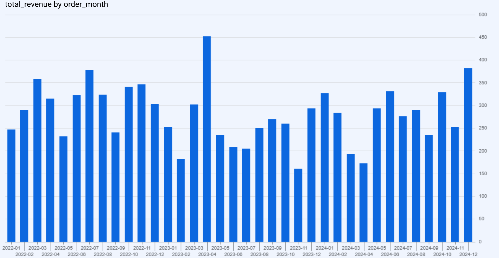
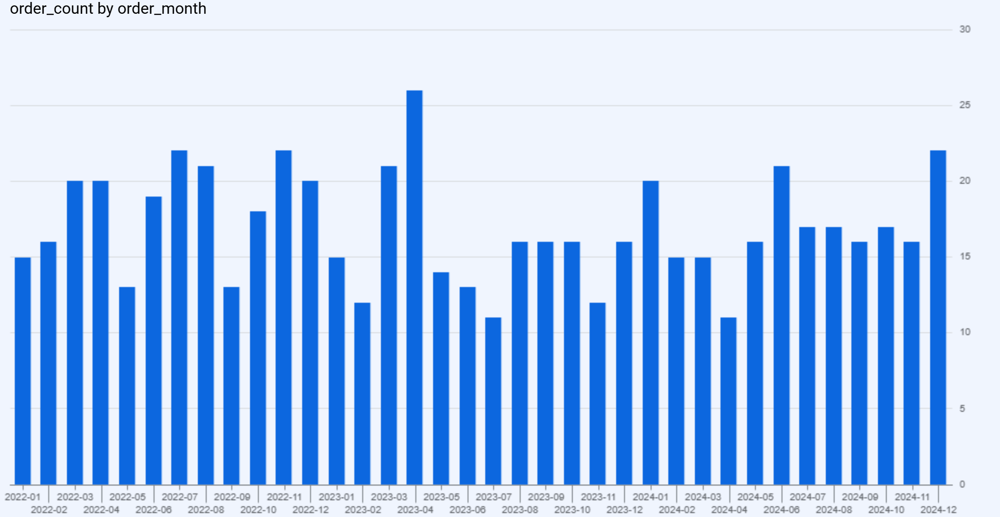
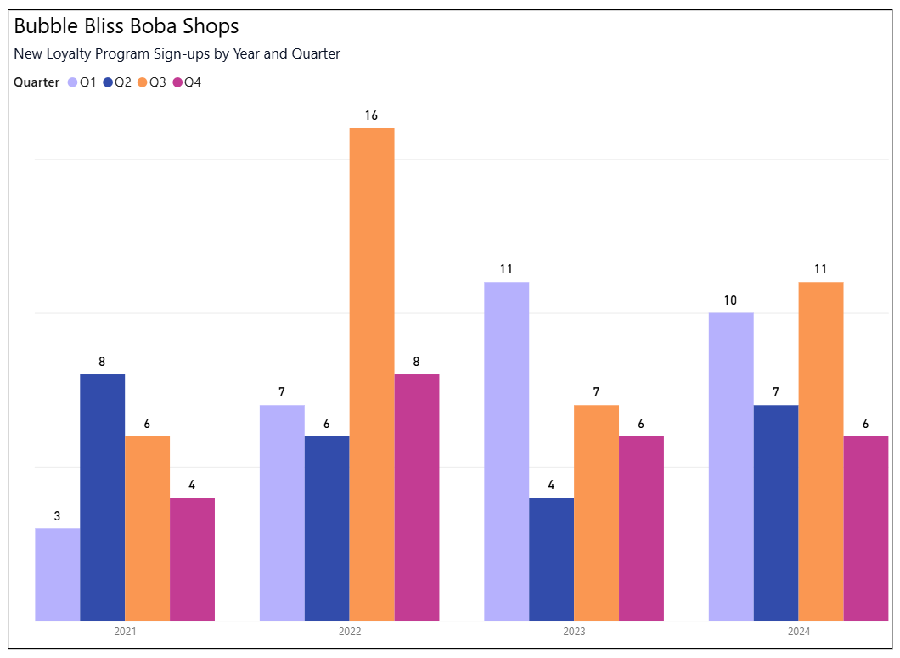

# 🧋 Bubble Bliss Boba Shop SQL Analysis

**Tools:** BigQuery, SQL, Power BI, Gemini AI  
**Year:** 2026

## Project Overview
Analysis of a fictional boba tea shop chain with 5 Chicago-area locations using relational SQL datasets. The project covers core data analyst skills including multi-table joins, aggregations, data quality checks, duplicate detection, trend analysis, and anomaly detection.

## Dataset
5 related tables totaling 4,500+ records:
- `locations` — 5 store locations
- `menu_items` — drinks and toppings
- `customers` — 120 loyalty customers
- `orders` — 900 orders with intentional data quality issues
- `order_items` — individual line items per order

## Key Findings
- Identified 207 orders attributed to an inactive location
- Detected 8 duplicate customer accounts via email matching
- Surfaced statistical outliers using CTE-based z-score analysis (peak z-score: 27.02)
- De-duplicated order records using ROW_NUMBER() window function
- Identified unexplained revenue spike in April 2023 warranting further investigation
- Visualized monthly revenue trends in BigQuery and quarterly customer signups in Power BI

## Skills Demonstrated
- Multi-table JOINs across 5 related tables
- Aggregations with GROUP BY, HAVING, and window functions
- Data quality and integrity checks
- Duplicate detection and remediation
- Trend analysis and anomaly detection using statistical methods
- CTE pipelines for executive reporting
- Data visualization in BigQuery and Power BI
- AI-assisted query development using Gemini

## Visualizations

### Monthly Revenue Trend

### Monthly Order Count

### New Loyalty Program Sign-ups by Quarter

